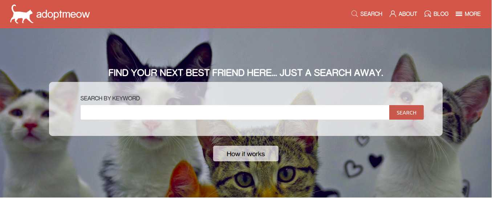

# adoptmeow

 ## This page is my Capstone project for the Microverse's HTML and CSS course curriculum. The design was inspired on the work of [Mathew Njuguna](https://www.behance.net/mathewnjuguna) and others on Behance, specially this project: [patashuleke](https://www.behance.net/gallery/25563385/PatashuleKE). I have learned a lot and am very thankful!

### The original design is a Directory of Schools, but we are encouraged to change the theme to a different one, so I went ahead and created a site that helps people adopt cats. It would be a bridge between those who found cats abandoned, those who can keep them temporarily, those who can help with resources, and those who want to adopt them for good. 

  ### AUTHOR - Pedro Henrique Ferreira Donda
    GitHub: https://github.com/phfdonda
    LinkedIn: https://www.linkedin.com/in/pedro-donda-808621bb/

### Built with:
    HTML5
    CSS3

### Check it online!

  [Live Preview](https://rawcdn.githack.com/phfdonda/Capstone_HTML-CSS_Directory_of_Schools/0980f53f028988db11534dfa0225635834dc5b88/index.html)

### The specifications of the project were as follows:

#### 1- This is a real-world-like project with a design made by a professional. I didn't have an exact page to just inspect the code and have tips of how to build it; I had only the design to be inspired upon. I was expected to select, with my own knowledge, the proper technologies and techniques to achieve the business specifications.

#### 2- I had to create three pages: 
- the main page (search page), with a link to the results page
- the search results page, with a list of schools (or, in this case, cat shelters) each with a link to the detail shelter page.
- the detail shelter page.

#### 3- Each of these pages should have versions for 3 different screen sizes: 

- mobile: up to 768px
- tablet: up to 1024px
- desktop: from 1024px

#### 4- You should follow the guidelines of the given design, including:

- colors (they are not explicitly in the design, but you can pick them from the design page)
- typographies: font face, size and weight (use a similar one given the design)
- layout: composition and space between elements, for the 3 given screen sizes

### Contributions and issues are welcome!

License
This project is MIT licensed.
